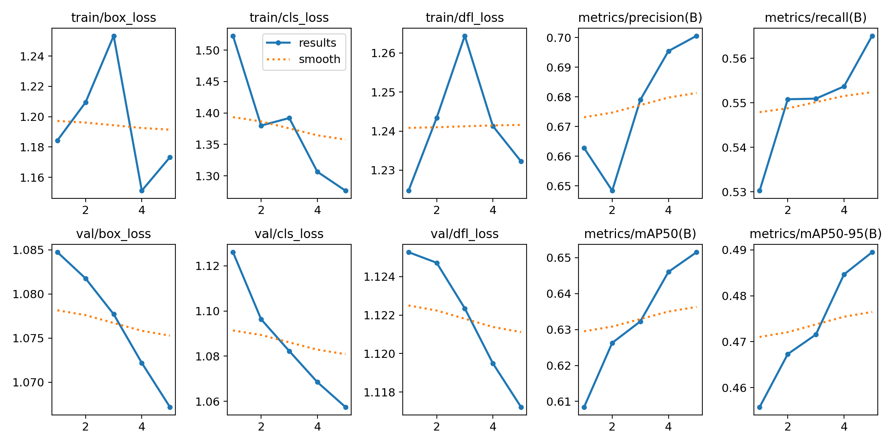

# Week 3 Task 1 - Object Detection & Semantic Segmentation

## 📊 Performance Metrics

### Detection Metrics:

* Box Precision: 0.7006
* Box Recall: 0.5650
* Box mAP50: 0.6515
* Box mAP50-95: 0.4895

### Segmentation Metrics:

* Mask Precision: 0.686
* Mask Recall: 0.617
* Mask mAP50: 0.582
* Mask mAP50-95: 0.407

## 📈 Training Results

## 🎥 Final Output Video

The final segmented video with added background audio:

* Semantic segmentation highlights objects with colored masks
* Only the added audio is present in the video

## 🧠 Description

This project demonstrates object detection and semantic segmentation using YOLOv8. Detection provides bounding boxes, while segmentation provides pixel-level classification of objects.

The model was evaluated using precision, recall, and mAP metrics. The results indicate reasonable performance in both detection and segmentation tasks.

# Object Detection and Segmentation using YOLO TASK2

## 📌 Overview

This project demonstrates object detection and segmentation using YOLO models.

## 🎯 Tasks Performed

* Raw video processing
* Object Detection using YOLOv8
* Object Segmentation using YOLOv8-seg
* Video stacking using FFmpeg
* Audio replacement

## 🛠️ Tools Used

* Python
* YOLOv8 (Ultralytics)
* FFmpeg

## 📂 Outputs

* Raw Video
* Detection Video (Bounding Boxes)
* Segmentation Video (Masks)
* Final Stacked Video

## ▶️ Final Output

The final video displays:

1. Raw Video
2. Detection Output
3. Segmentation Output

## 🚀 How to Run

1. Run detect.py for detection
2. Run segment.py for segmentation
3. Use FFmpeg commands to stack videos

## 📌 Note

All outputs are based on pre-trained YOLO models.

## 🚀 Conclusion

Semantic segmentation helps in identifying precise object boundaries, which is useful in applications like autonomous driving and medical imaging.
